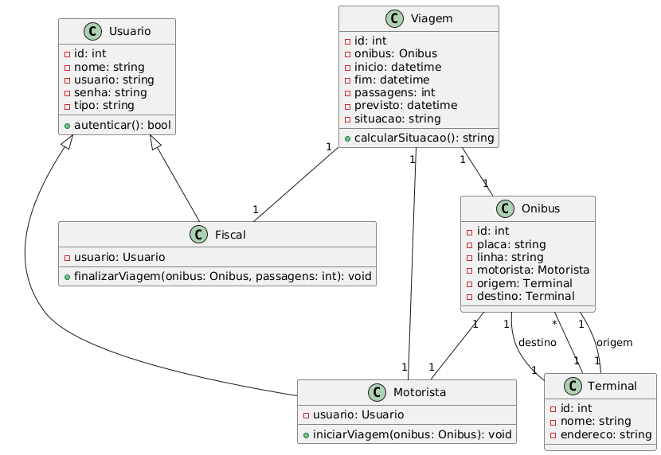

## 🚍 EPF: Sistema de Entrada e Saída de Ônibus

Este projeto implementa um sistema web para **controle de fluxo de ônibus em terminais**, desenvolvido em Python com o microframework **Bottle**, orientado a objetos, utilizando arquivos JSON como persistência de dados.

### 🎯 Objetivo

Permitir que:

* **Motoristas** iniciem viagens (“start”).
* **Fiscais** finalizem viagens e registrem o número de passagens.
* O sistema calcule atrasos ou adiantamentos com base em previsões de horário.

### 📂 Estrutura do Projeto

```
epf-entrada-saida-onibus/
├── main.py              # Ponto de entrada da aplicação
├── app.py               # Configuração do Bottle e setup de rotas
├── config.py            # Constantes e caminhos (opcional)
├── requirements.txt     # Dependências (bottle, etc.)
├── README.md            # Documentação do projeto
├── controllers/         # Definição de rotas e controllers
├── services/            # Lógica de negócio e persistência JSON
├── models/              # Entidades do domínio
├── views/               # Templates Bottle (HTML .tpl)
├── static/              # Arquivos estáticos (CSS, JS, imagens)
└── data/                # Arquivos JSON ("bancos de dados")
```

### ⚙️ Como Executar (local)

0-Modifique config.py e altere para o texto comentado.

1. **Clone o repositório**:

   git clone <URL_DO_REPO>
   cd epf-entrada-saida-onibus


2. **Crie e ative o ambiente virtual**:


   python -m venv venv
   source venv/bin/activate   # Linux/Mac
   venv\\Scripts\\activate    # Windows


3. **Instale as dependências**:

   pip install -r requirements.txt


4. **Inicie a aplicação**:

   python main.py

5. **Acesse no navegador**:

[http://localhost:8080''']

### 📋 Funcionalidades Principais

* **Login e controle de acesso**: Admin, Fiscal, Motorista.
* **CRUD de usuários** (Admin).
* **Listagem e registro de viagens**:

  * Início de viagem pelo Motorista.
  * Finalização pelo Fiscal com contagem de passagens.
  * Cálculo de atraso/adiantamento comparado à previsão.
* **Visão de status dos ônibus**: placa, linha, origem, destino, previsão, chegada.

### 🔧 Configurações

* Arquivos de dados no diretório `data/`. Para resetar os dados, delete os arquivos JSON.
* Adapte `config.py` para alterar caminhos ou parâmetros globais.

### 🚀 Deploy

Para testar online (ex: Render.com):

1. Configure `start.sh` com:

   #!/bin/bash
   python3 main.py

2. No `requirements.txt`, inclua:


bottle

3. Aponte o comando de start no serviço de deploy para `bash start.sh`.
## 📊 Diagrama UML do Sistema

]

> **Descrição:**  
> Diagrama de classes que mostra as principais entidades do sistema, suas relações e atributos.
### 📚 Referências
- Projeto-base BMVC: https://github.com/hgmachine/bmvc_start_from_this
- Bottle Framework: https://bottlepy.org/

---

*Desenvolvido por Ricardo Eduardo da Silva Leal (242015405) como EPF de Orientação a Objetos*

```
